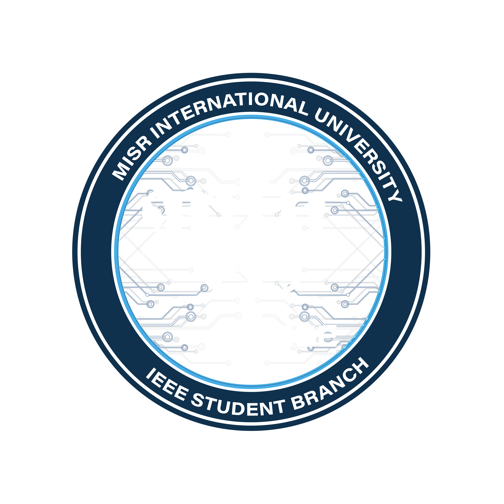

# IEEE MIU Student Branch Platform 🚀
**A Next-Generation Student Community & Learning System**



## 🌟 Overview
This project is a bespoke, high-performance web platform designed for the **IEEE MIU Student Branch**. It goes beyond a simple website, integrating a fully functional **Learning Management System (LMS)**, a dynamic **Event & Gallery Hub**, and a robust **Administrative Dashboard**.

Built from scratch using a custom PHP architecture, it delivers a lightning-fast, secure, and visually stunning experience without the bloat of heavy frameworks.

---

## ✨ Features "How It Was Made"

### 1. 🎓 Custom LMS (Learning Management System)
*   **"Little Moodle" Engine**: A lightweight yet powerful course management system.
*   **Resource Management**: Admins can upload unlimited supplementary materials (PDFs, PPTs, code snippets) to specific courses.
*   **Video Integration**: Seamlessly embed lecture videos and external content.
*   **Enrolled Student View**: Students have a dedicated dashboard to track their enrolled courses and access materials.

### 2. 📸 Dynamic Gallery & "Time Capsule"
*   **Hybrid Gallery System**:
    *   **Event-Based Photos**: automatically linked to specific events.
    *   **Standalone Collections**: Create custom albums (e.g., "Junior TechExpo") independent of events.
*   **Smart Uploads**: Bulk upload capability with auto-optimization.
*   **Mosaic Feed**: A custom algorithm shuffles event highlights and standalone collections for a vibrant, ever-changing homepage stream.

### 3. 📅 Event Management Ecosystem
*   **Event Lifecycle**: Full CRUD (Create, Read, Update, Delete) support for workshops, seminars, and tech talks.
*   **Ticket & Registration**: Built-in status tracking (Open/Closed) and link management for ticketing platforms.
*   **Visual Previews**: Live preview of event cards in the admin dashboard before publishing.

### 4. 📝 Dynamic Form Builder
*   **No-Code Form Engine**: Admins can create complex forms with drag-and-drop ease.
*   **Rich Input Support**: Text, Date, Radio, Checkbox, Select, and File Uploads.
*   **Response Analytics**: View and export form submissions directly from the dashboard.

### 5. 🛡️ Secure Student Portal
*   **Authentication System**: Custom-built login and registration system with secure password hashing.
*   **Profile Management**: Students can manage their data and view their specific interactions with the branch.

### 6. 💎 Glassmorphism UI / UX
*   **Aesthetic**: A consistent, modern "Glassmorphism" design language using translucent layers, vibrant gradients, and blurred backdrops.
*   **Responsive**: Mobile-first architecture ensuring perfect rendering on all devices.
*   **Pure CSS**: All visual effects are achieved with highly optimized, vanilla CSS variables (no heavy UI frameworks).

---

## 🏗️ Architecture & Technology Stack

This platform was engineered with performance and maintainability in mind.

### **The Core (Backend)**
*   **Language**: **PHP 8+** (Strict typing enabled where applicable).
*   **Database**: **MySQL / MariaDB** with a custom PDO wrapper class (`Database.php`) for secure, injection-proof queries.
*   **Architecture**: A custom **MVC-lite** (Model-View-Controller) structure:
    *   **Models**: Dedicated classes for business logic (`Course.php`, `Event.php`, `GalleryModel.php`, `BoardMember.php`).
    *   **Views**: Clean separation of logic and presentation.
    *   **Routing**: Intelligent URL routing for clean endpoints.

### **The Visuals (Frontend)**
*   **Styling**: **Vanilla CSS3** with extensive usage of CSS Variables (`:root`) for theming.
    *   *Why?* To achieve the specific glassmorphism look without the constraint of Bootstrap or Tailwind defaults.
*   **Interactivity**: **Vanilla JavaScript (ES6+)**.
    *   *Features*: AJAX for non-blocking UI updates, dynamic DOM manipulation for the form builder.

### **Security & Performance**
*   **Security**: CSRF protection, XSS data sanitization, and prepared SQL statements.
*   **Performance**: Lazy loading for images, script deferment, and minimal external dependencies.

---

## � Installation & Setup

1.  **Clone the Repository**
    ```bash
    git clone https://github.com/karimcpp110/ieee-miu.git
    ```

2.  **Database Configuration**
    *   Import `database_setup.sql` into your MySQL database.
    *   Configure credentials in `Database.php`.

3.  **Run Migrations**
    *   Execute `php migrate_all.php` to ensure all latest table structures are applied.

4.  **Launch**
    *   Serve the project via Apache/Nginx or PHP's built-in server:
        ```bash
        php -S localhost:8000
        ```

---

## 👨‍� Developer

**Karim Wael**
*Full-Stack Engineer & Architect*

📫 [Email](mailto:kwael7934@gmail.com) | [LinkedIn](https://www.linkedin.com/in/karim-wael-40132b360/)

Built with ❤️ for the IEEE MIU Student Branch.
